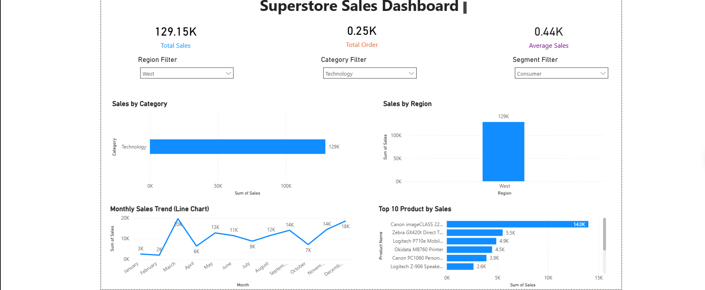

# Superstore Sales Dashboard (Power BI)

## 📊 Project Overview
This project is a Power BI dashboard analyzing sales performance across different regions, categories, and customer segments.

## 🔧 Tools Used
- Power BI
- Power Query
- DAX (basic)

## 📈 Key Features
- KPI Cards (Total Sales, Total Order , Average Sales)
- Sales by Category and Region
- Monthly Sales Trend
- Top 10 Products by Sales
- Interactive Filters (Region, Category, Segment)

## 🔍 Key Insights
- Technology category generates highest sales
- West region performs best
- Sales peak in Q4

## 📸 Dashboard Preview

